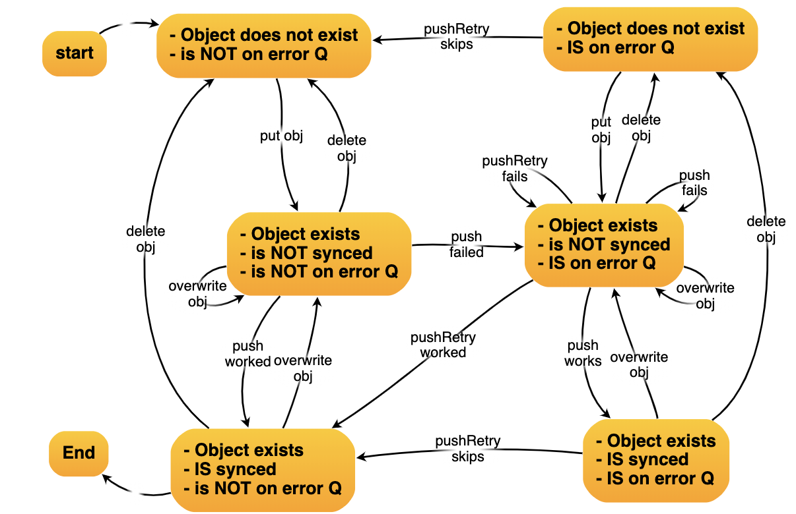

# sftp-lambda

Serverless lambda functions to sync files between AWS S3 and an SFTP server.

Inspired by https://github.com/gilt/s3-sftp-bridge

## Contents

- [sftp-lambda](#sftp-lambda)
  - [Contents](#contents)
  - [Characteristics & Use Cases](#characteristics--use-cases)
  - [Description](#description)
  - [How it works](#how-it-works)
    - [Activity Diagram](#activity-diagram)
  - [Configuration](#configuration)
    - [Environment Variables](#environment-variables)
    - [Custom VPC](#custom-vpc)
  - [Design Details](#design-details)
    - [Lambdas](#lambdas)
      - [pull (S3 <- SFTP)](#pull-s3---sftp)
      - [push (S3 -> SFTP)](#push-s3---sftp)
      - [pushRetry (S3 -> SFTP)](#pushretry-s3---sftp)
    - [Sequence Diagram](#sequence-diagram)
    - [State Transitions](#state-transitions)
      - [Valid State Transitions for push & pushRetry](#valid-state-transitions-for-push--pushretry)

## Characteristics & Use Cases

- you don't want to run your own SFTP server or pay for a service
- a 3rd party provides an SFTP server where you need to push / pull files
- **_YOU_** always initiate the connection (push or pull), not the 3rd party
- this solution is appropriate for batch, not streaming
  - the data you pull is not needed urgently, e.g. you are happy to pull
    files every half hour or even less frequently
- **_CHEAP_**
  - cheaper than _AWS Transfer for SFTP_
  - **_MUCH_** cheaper if you don't need a static IP address for whitelisting on the FTP server
    - it's just the cost of the Lambda executions
    - but this is not recommended
      - best practice is to use a static IP and get it whitelisted
  - at least **_FIVE TIMES_** cheaper even if you **_DO_** need a fixed IP
    - the main cost of the fixed IP is the price of a NAT gateway + elastic IP
    - these are still very cheap compared to _AWS Transfer for SFTP_

## Description

- All connections are initiated from **your** AWS account
  - you therefore have full control and visibilty of transfers
- 3 lambda functions:
  - one for pulling batches of files from SFTP (`pull`)
  - two for pushing individual files to SFTP (`push` & `pushRetry`)
- Shared-nothing architecture
  - deploy multiple instances
    of the same lambdas to achieve multiple connection "flows",
    eg. different cron schedules for different FTP servers, directories or buckets

## How it works

- S3 to SFTP (`push` & `pushRetry`)

  - triggered whenever a file is uploaded to an S3 bucket
  - the file is immediately transfered to the configured FTP server
  - every S3 object will be transferred in its own lambda & SFTP connection
    - recommend Lambda parallelism of `1` to avoid certain edge cases (when user
      over-writes and object which is currently being transferred)
  - S3 metadata on each object is updated to indicate that the object has been
    successfully transferred
  - failures are sent to an SQS queue for later `pushRetry`

- S3 from SFTP (`pull`)
  - pulls multiple files in one connection
  - pulls tree structures recursively
  - recreates the same directory structure in the target bucket
  - successfully transferred files are moved to a `.done` directory on the SFTP server
    - this prevents files being copied multiple times
    - the SFTP server owner can therefore see which files have been transferred
    - if a file needs to be re-transferred for any reason,
      the SFTP server owner can move it from the `.done` directory back up to its parent directory
    - note that a file of the same name in `.done` will be over-written by a new file of the same name
  - an optional retention period can be configured to purge files from
    the `.done` directory after a configurable number of days

### Activity Diagram

## Configuration

- Deployment of the Lambdas and the related resources (e.g. SQS queues) is up to you.
- Sample configurations are provided (TODO).
  - Serverless is recommended.
- Configuration of SFTP details & file / bucket paths is via Lambda environment variables
- Implement multiple "flows" (e.g. different target directories, buckets, or FTP servers with their
  own connection information) by deploying multiple instances of the Lambdas with relevant variables.
- Each push "flow" will need it's own SQS queue.
- It is recommended that the `push` & `pushRetry` lambdas for each flow are configured
  with parallelism of `1`. This will be slower when writing multiple objects to a bucket
  but has the following advantages:
  - It prevents the SFTP server from being over-loaded with multiple simultaneous connects
  - It prevents some unusual edge cases occuring, for example if you put an S3 object
    then immediately overwrite it, 2 lambdas would be triggered for the same object,
    potentially racing each other to put different versions of the same object.
    Which will win ? It's better to not leave this to chance.

### Environment Variables

Not all variables are required by all lambdas, as described below:

| variable                        | applies to function | notes                                                                                                                                                            |
| ------------------------------- | ------------------- | ---------------------------------------------------------------------------------------------------------------------------------------------------------------- |
| SFTP_HOST, SFTP_PORT, SFTP_USER | all                 | SSH (SFTP) connection information                                                                                                                                |
| SFTP_PRIVATE_KEY                | all                 | SSH private key (the key multiline contents, not the filename)                                                                                                   |
| SFTP_SSH_READY_TIMEOUT_SECONDS  | all                 | timeout for establishing the initial ssh connection (see https://github.com/mscdex/ssh2#client-methods)                                                          |
| SFTP_TARGET_S3_BUCKET           | pull                | target S3 bucket                                                                                                                                                 |
| SFTP_TARGET_S3_PREFIX           | pull                | target S3 object key prefix                                                                                                                                      |
| SFTP_SOURCE_DIR                 | pull                | source directory to pull from                                                                                                                                    |
| SFTP_FILE_RETENTION_DAYS        | pull                | how many days after file transfer to keep a file on the source SFTP server (in the `.done` directory) before deleting. Set this to zero to disable this feature. |
| SFTP_RETRY_QUEUE_NAME           | push, pushRetry     | SQS pushRetry queue name                                                                                                                                         |
| SFTP_TARGET_DIR                 | push, pushRetry     | target directory on FTP server                                                                                                                                   |
| SFTP_PUSH_TIMEOUT_SECONDS       | push, pushRetry     | overall timeout for pushing a file                                                                                                                               |

### Custom VPC

Setup a custom VPC if you want a fixed IP address.

The approach here is to run the Lambdas in a private subnet and route via a NAT
in a public subnet which has an EIP (fixed IP address).

## Design Details

### Lambdas

#### pull (S3 <- SFTP)

- scheduled via CloudWatch cron
- connects to the SFTP server & recursively copies the source directory to the S3 bucket
- the directory structure in the target bucket will match the directory
  structure on the SFTP server, with an optional prefix path added to each object key
  in the S3 bucket (effectively, a target S3 directory).
- successfully transferred files are moved to a `.done` directory on the source SFTP server
  - a `.done` directory is created within each directory of the tree structure being copied
- on error, this lambda will fail

#### push (S3 -> SFTP)

- Called when a single object is uploaded to an S3 bucket (new or overwrite)
- Push the single file to SFTP server
  - If successful, mark the metadata on the object as synced.
- On error:
  - push the failed event to a pushRetry SQS queue, then **_SUCCEED_**
    - If the lambda were to fail, the AWS Lambda service will retry
      the same object, and we'd end up with multiple events for the same object
      on the pushRetry queue. The retry logic should code with this, but it would
      be wasteful.

#### pushRetry (S3 -> SFTP)

- scheduled via CloudWatch cron
- for each failed event message on the pushRetry queue
  - first, check if object already synced
    - this could happen if the S3 object has been over-written with a newer version
      and successfully transferred via the `push` lambda
      - note that overwriting an S3 object causes the sync metadata to be deleted
  - write the file to the SFTP server
  - if successful, delete message from the pushRetry queue
- on error, this lambda should fail

### Sequence Diagram

### State Transitions

State transition tables and diagrams help to visualise the various situations that can occur,
and highlight edge cases.

`push` and `pushRetry` are the most complicated, because:

- there is a retry queue
- at any time a user can overwrite or delete the S3 object

#### Valid State Transitions for push & pushRetry

| State Id | object exists | is synced | is on error Q | Next State | put new object | overwrite object | push works | push fails | pushRetry skips | pushRetry works | pushRetry fails | deletes object |
| -------- | ------------- | --------- | ------------- | ---------- | -------------- | ---------------- | ---------- | ---------- | --------------- | --------------- | --------------- | -------------- |
| 1        | no            | -         | no            | ->         | 3              | -                | -          | -          | -               | -               | -               | -              |
| 2        | no            | -         | yes           | ->         | 4              | -                | -          | -          | 1               | -               | -               | -              |
| 3        | yes           | no        | no            | ->         | -              | 3                | 5          | 4          | -               | -               | -               | 1              |
| 4        | yes           | no        | yes           | ->         | -              | 4                | 6          | 4          | -               | 5               | 4               | 2              |
| 5        | yes           | yes       | no            | ->         | -              | 3                | -          | -          | -               | -               | -               | 1              |
| 6        | yes           | yes       | yes           | ->         | -              | 4                | -          | -          | 5               | -               | -               | 2              |

