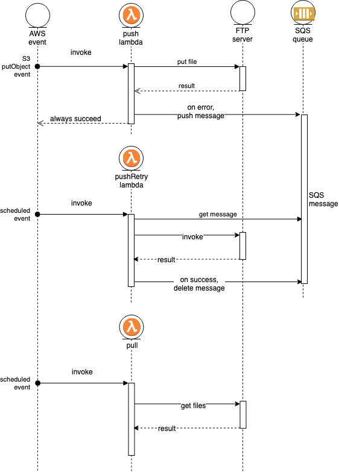
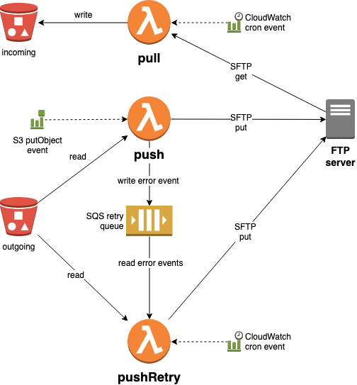

# sftp-lambda

Serverless lambda functions to sync files between AWS S3 and an SFTP server.

## Use case

1. the 3rd party provides the SFTP server
2. _you_ initiate the connection (push or pull), not the 3rd party
3. very cheap compared to running your own FTP server or paying for an FTP service (never pay for idle!)

## Characteristics

- cheaper than _AWS Transfer for SFTP_
  - **much** cheaper if you don't need a static IP address for whitelisting on the FTP server
    - it's just the cost of the Lambdas executions
  - at least **5x** cheaper even if you _do_ need a fixed IP
    - in this case, the main cost is for a NAT gateway and elastic IP which are still much
      cheaper than _AWS Transfer for SFTP_
- All connections are initiated from **your** AWS account
  - you therefore have full control and visibilty of transfers
- 3 lambda functions:
  - one for pulling batches of files from SFTP (`pull`)
  - two for pushing individual files to SFTP (`push` & `pushRetry`)
- Shared-nothing architecture
  - deploy multiple instances
    of the same lambdas to achieve multiple connection "flows",
    eg. different cron schedules for different FTP servers, directories or buckets
- Behaviour
  - S3 -> SFTP (`push` & `pushRetry`)
    - triggered whenever a file is uploaded to an S3 bucket
      - the file is immediately transfered to the configured FTP server
      - every S3 object will be transferred in its own lambda & SFTP connection
    - failures are sent to an SQS queue for later pushRetry
    - S3 metadata on each object denotes when the object has been successfully transferred
  - S3 <- SFTP (`pull`)
    - pulls multiple files in one connection
    - pulls tree structures recursively
    - transferred files are moved to a `.done` directory on the SFTP server
      - this prevents files being copied multiple times
      - be re-transferred later
      - the SFTP server owner therefore has visibility

## Configuration

- Configuration (e.g. SFTP connection information) is via Lambda environment variables
- To implement multiple "flows" (e.g. different target directories, buckets, or FTP servers with their
  own connection information), deploy multiple instances of the lambdas with relevant variables.
- Each "flow" will need it's own SQS queue if the target directory & FTP server connection are different.

### Environment Variables

Not all variables are required by all lambdas, as described below:

| variable                        | applies to function | notes                                                                               |
| ------------------------------- | ------------------- | ----------------------------------------------------------------------------------- |
| SFTP_HOST, SFTP_PORT, SFTP_USER | all                 | SSH (SFTP) connection information                                                   |
| SFTP_PRIVATE_KEY                | all                 | SSH private key (the key multiline contents, not the filename)                      |
| SFTP_RETRY_QUEUE_NAME           | push, pushRetry     | SQS pushRetry queue name                                                            |
| SFTP_TARGET_S3_BUCKET           | pull                | target S3 bucket                                                                    |
| SFTP_SOURCE_DIR                 | pull                | source directory to pull from                                                       |
| SFTP_FILE_RETENTION_DAYS        | pull                | how many days after file transfer to keep file on source FTP server before deleting |

## Infrastructure Configuraion

Deployment of related resources (e.g. SQS queues) is up to you.
Sample configurations are provided (TODO).
Serverless is recommended.

## Design

### pull (S3 <- SFTP)

- scheduled via CloudWatch cron
- connects to SFTP server & copy recursive tree structure to S3 bucket
- moves copied files to `.done` directory (TODO: in same structure ?)
- on error, this lambda fails
- TODO: document the target path

### push (S3 -> SFTP)

- called when a single object is uploaded to an S3 bucket
- first check if the object already marked as synced
  - TODO: is this necessary ?
- pushes a single file to SFTP server
  - if it succeeds, marks meta data on object as synced
- on error:
  - push failed event to SQS
  - after pushing the event onto the pushRetry queue, the lambda must SUCCEED
    - this seems counter-intuitive, but the lambda must succeed even hough there was an error,
      otherwise the AWS Lambda service will retry the same object,
      pushing multiple events for the same object onto the pushRetry queue

### pushRetry (S3 -> SFTP)

- scheduled via CloudWatch cron
- for each failed event message on the pushRetry queue
  - first, check if object already synced
    - TODO: is this necessary ?
  - write the file to the SFTP server
  - if successful, delete message from the pushRetry queue
- on error, this lambda should fail

## Diagrams

### Sequence Diagram

### Activity Diagram

### Custom VPC

Setup a custom VPC if you want a fixed IP address.

